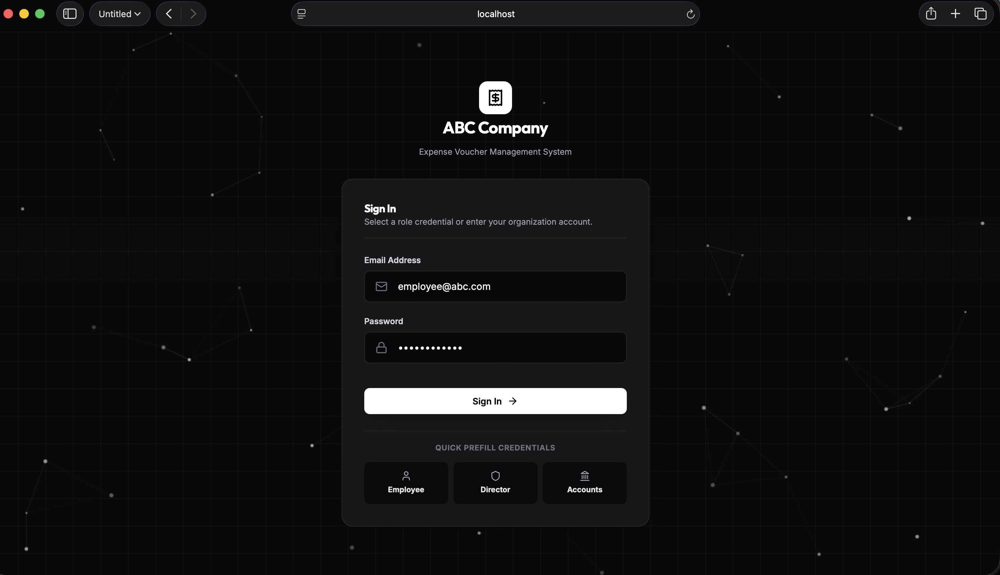
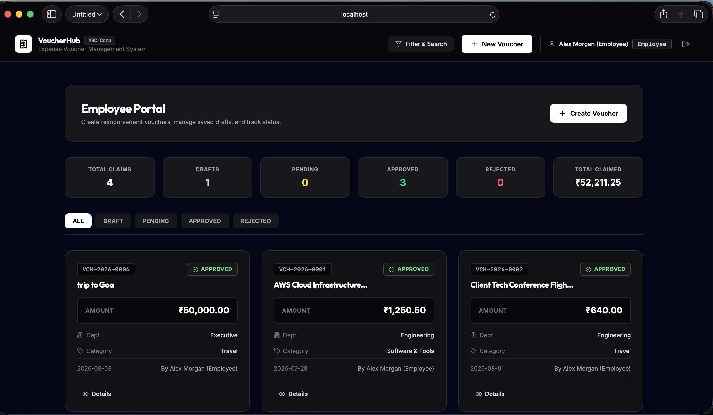
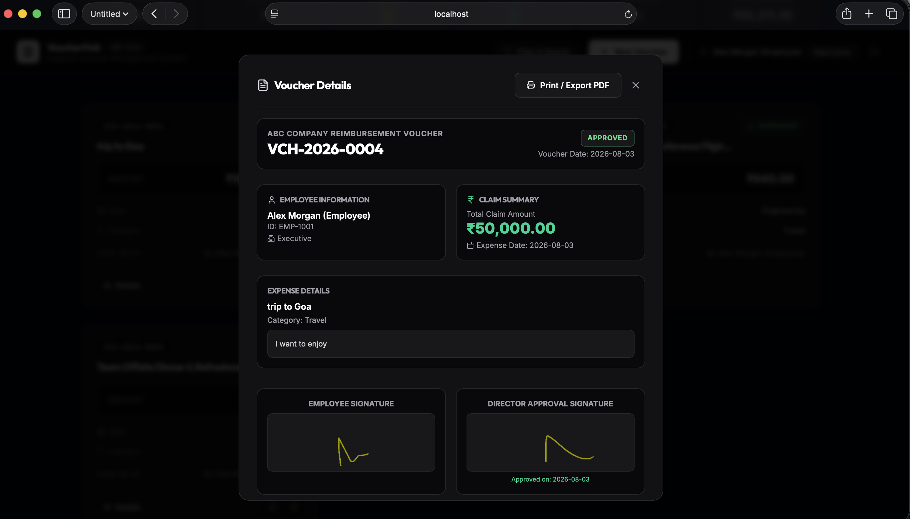
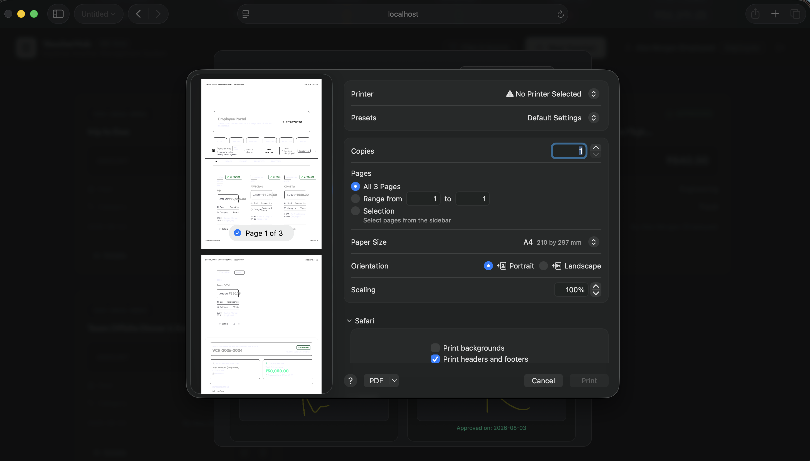
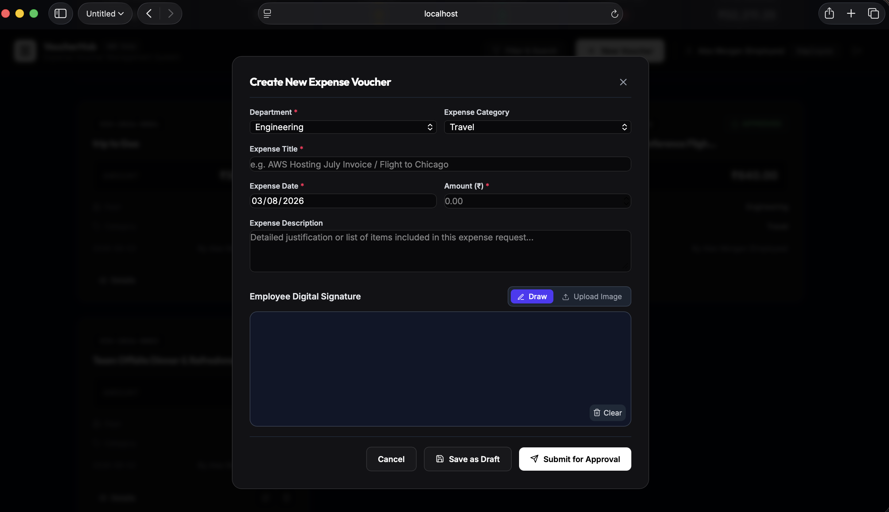
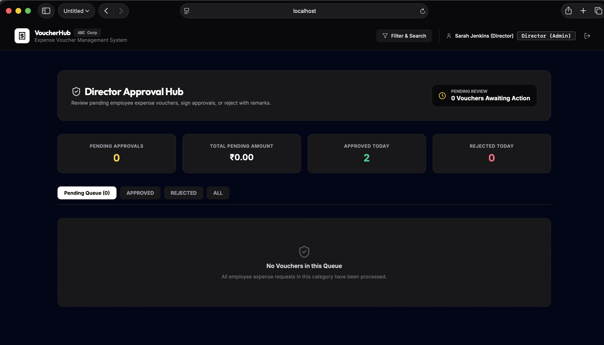
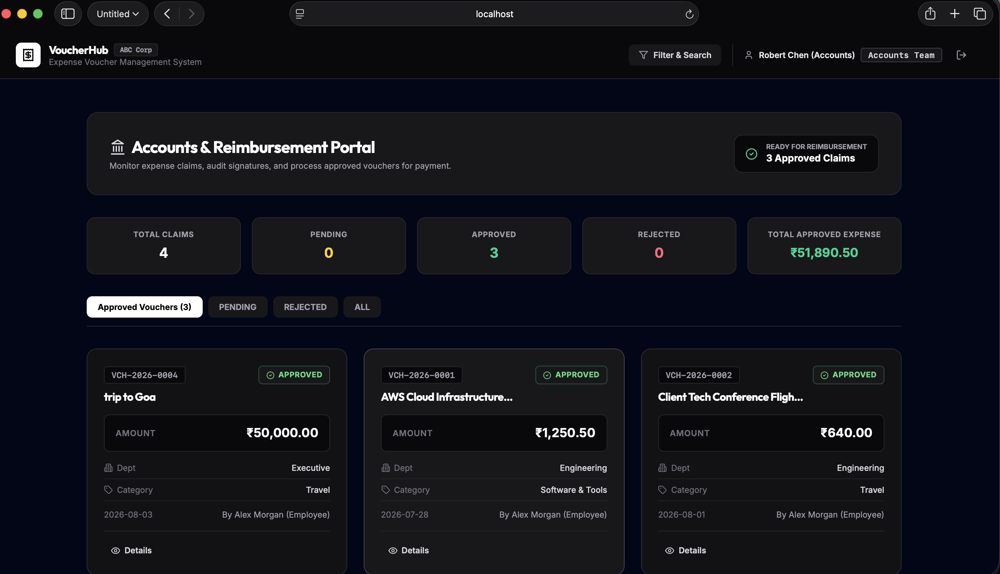
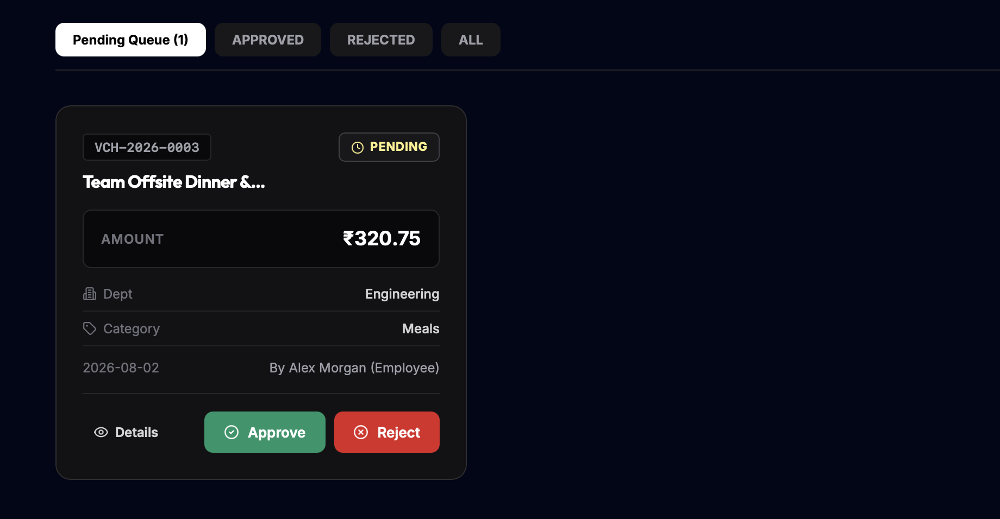

# Expense Voucher Management System

An enterprise-grade Full-Stack Expense Voucher Creation, Approval, and Reimbursement Tracking Application designed for **ABC Company**. This system digitizes the traditional paper-based expense workflow, ensuring complete transparency, role-based authorization, digital signature validation, dynamic search/filter, and real-time dashboard analytics.

---

## Application Screenshots

### 1. Sign In & Role Authentication
*Minimalist dark screen with ambient moving background particle animation and 1-click credential prefill.*



---

### 2. Employee Portal & Voucher Workflow
*Real-time metrics tracking total claims, drafts, pending approvals, approved vouchers, and sum claimed.*



#### Create Expense Voucher Form


#### Digital Signature Pad (Canvas Draw & Upload)


---

### 3. Director Approval Hub
*Executive queue showing pending employee requests with instant review tools.*



#### Director Digital Authorization Signature Modal


---

### 4. Accounts & Reimbursement Portal
*Organization-wide financial summary and approved claim settlement monitoring.*



#### Voucher Details & Printable Receipt Format


---

## Features Overview

### 1. Employee Module
- **Dashboard Stats**: Real-time breakdown of Total Claims, Drafts, Pending Approvals, Approved Vouchers, Rejected Vouchers, and Total Amount Claimed (in ₹).
- **Voucher Creation & Editing**: Create vouchers with mandatory validation (Department, Expense Title, Expense Date, Amount > 0). Save as Draft or submit for approval.
- **Digital Signatures**: Sign directly on an interactive HTML5 Canvas pad or upload signature images (PNG, JPG, SVG).
- **Draft Workflow**: Full edit and delete privileges for Draft vouchers. Submitted vouchers instantly become read-only.
- **Status Tracking**: Track approval progress and view Director rejection remarks if rejected.

### 2. Director (Admin) Module
- **Executive Dashboard**: Monitor Pending Approval Count, Total Pending Amount, Approved Today, and Rejected Today.
- **Approval Queue**: Dedicated interface to review pending employee expense requests.
- **Approval Action**: Digitally sign vouchers to grant reimbursement approval (status updates to `APPROVED` with approval date).
- **Rejection Action**: Reject vouchers with mandatory rejection reason remarks (status updates to `REJECTED`).

### 3. Accounts Team Module
- **Financial Monitoring**: Organization-wide view of all expense claims and total approved expense reimbursement budget.
- **Audit & Compliance**: Access employee and director digital signatures, expense descriptions, department tags, and audit timestamps.
- **Print & PDF Export**: One-click printable voucher receipt layout formatted for record-keeping and auditing.

### 4. Search, Filter & Sort (Bonus Feature)
- Filter vouchers by:
  - **Keywords**: Voucher Number, Employee Name, Expense Title
  - **Department**: Engineering, Executive, Finance, Marketing, Sales, HR, Operations
  - **Expense Category**: Travel, Meals, Software & Tools, Office Supplies, Client Entertainment, etc.
  - **Status**: Draft, Submitted / Pending Approval, Approved, Rejected
  - **Date Range**: Expense date range filtering
  - **Amount Range**: Min and Max claim amount boundaries (in ₹)
  - **Sorting**: By Created Date, Expense Date, Amount, Voucher # (Ascending / Descending)

---

## Technology Stack

- **Frontend**: React (Vite), Lucide Icons, Minimalist Black & White CSS design system with moving canvas background animation.
- **Backend**: Node.js, Express.js RESTful API, Multer for multipart image signature uploads.
- **Database**: SQLite (via `better-sqlite3` with WAL mode & foreign key constraints).
- **Authentication**: JWT (JSON Web Tokens) with role-based access control middleware (`EMPLOYEE`, `DIRECTOR`, `ACCOUNTS`).

---

## Quick Setup & Execution Guide

### Prerequisites
- Node.js (v18 or higher recommended)
- npm or yarn

### 1. Clone & Setup Backend
```bash
cd backend
npm install
npm run seed  # Seeds default database & accounts
node src/server.js  # Starts Express server on http://localhost:5001
```

### 2. Setup Frontend
```bash
cd frontend
npm install
npm run dev  # Starts Vite server on http://localhost:3000
```

### 3. Access Application
Open your browser and navigate to `http://localhost:3000`.

---

## Demo Account Credentials

| Role | Email | Password | Primary Permissions |
| :--- | :--- | :--- | :--- |
| **Employee** | `employee@abc.com` | `Password123!` | Create, Draft, Edit Draft, Delete Draft, Upload Signature, Track Own Vouchers |
| **Director** | `director@abc.com` | `Password123!` | View All, Approve with Signature, Reject with Reason |
| **Accounts** | `accounts@abc.com` | `Password123!` | View All, Financial Stats, Print / PDF Export |

---

## Database Schema (`schema.sql`)

### 1. `users` Table
```sql
CREATE TABLE IF NOT EXISTS users (
    id INTEGER PRIMARY KEY AUTOINCREMENT,
    name TEXT NOT NULL,
    email TEXT NOT NULL UNIQUE,
    password TEXT NOT NULL,
    role TEXT NOT NULL CHECK(role IN ('EMPLOYEE', 'DIRECTOR', 'ACCOUNTS')),
    department TEXT NOT NULL,
    employee_code TEXT,
    created_at DATETIME DEFAULT CURRENT_TIMESTAMP
);
```

### 2. `vouchers` Table
```sql
CREATE TABLE IF NOT EXISTS vouchers (
    id INTEGER PRIMARY KEY AUTOINCREMENT,
    voucher_number TEXT NOT NULL UNIQUE, -- e.g. VCH-2026-0001
    user_id INTEGER NOT NULL,
    employee_name TEXT NOT NULL,
    employee_code TEXT,
    department TEXT NOT NULL,
    expense_title TEXT NOT NULL,
    expense_category TEXT NOT NULL,
    expense_description TEXT,
    expense_date TEXT NOT NULL,
    voucher_date TEXT NOT NULL,
    amount REAL NOT NULL CHECK(amount > 0),
    status TEXT NOT NULL DEFAULT 'DRAFT' CHECK(status IN ('DRAFT', 'SUBMITTED', 'PENDING_APPROVAL', 'APPROVED', 'REJECTED')),
    employee_signature TEXT,
    director_signature TEXT,
    rejection_reason TEXT,
    approval_date TEXT,
    created_at DATETIME DEFAULT CURRENT_TIMESTAMP,
    updated_at DATETIME DEFAULT CURRENT_TIMESTAMP,
    FOREIGN KEY (user_id) REFERENCES users(id) ON DELETE CASCADE
);
```

---

## API Documentation

### Authentication Endpoints
- `POST /api/auth/login` - Authenticate user & return JWT token
- `POST /api/auth/register` - Register a new user
- `GET /api/auth/me` - Fetch currently authenticated profile

### Voucher Endpoints (Protected by JWT)
- `GET /api/vouchers` - Get vouchers (Filtered by role; supports search, category, status, date & amount range query params)
- `GET /api/vouchers/:id` - Fetch single voucher details
- `POST /api/vouchers` - Create a voucher (`EMPLOYEE` only; supports signature upload)
- `PUT /api/vouchers/:id` - Edit draft voucher (`EMPLOYEE` only)
- `DELETE /api/vouchers/:id` - Delete draft voucher (`EMPLOYEE` only)
- `PUT /api/vouchers/:id/approve` - Approve voucher with Director signature (`DIRECTOR` only)
- `PUT /api/vouchers/:id/reject` - Reject voucher with rejection reason (`DIRECTOR` only)
- `GET /api/vouchers/dashboard/stats` - Fetch dashboard metrics per active role

---

## Assumptions Made During Development

1. **Voucher Numbering**: Voucher numbers follow an auto-generated format (`VCH-YYYY-0001`) initialized per year sequence.
2. **Read-Only Lock**: Once submitted, vouchers cannot be edited by employees unless rejected or saved back as draft.
3. **Database Simplicity**: SQLite is chosen for zero-dependency standalone execution. The SQL schema is fully compatible with PostgreSQL and MySQL if required.
4. **Signature Storage**: Signatures drawn on canvas are sent as Base64 strings or stored in `/uploads/` via Multer multipart forms.
